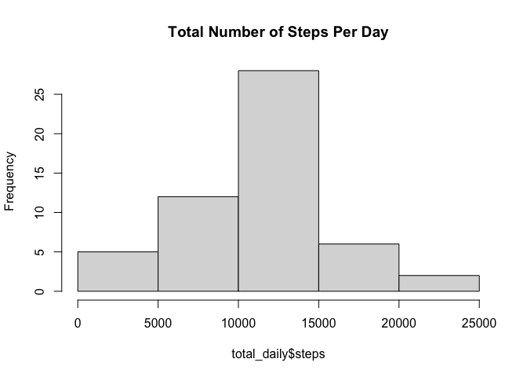
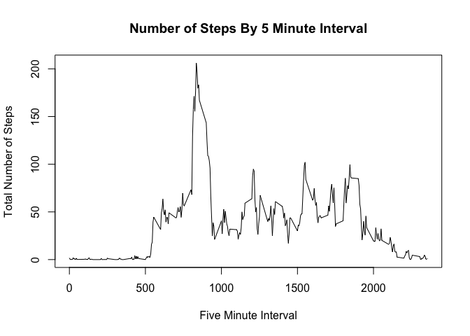
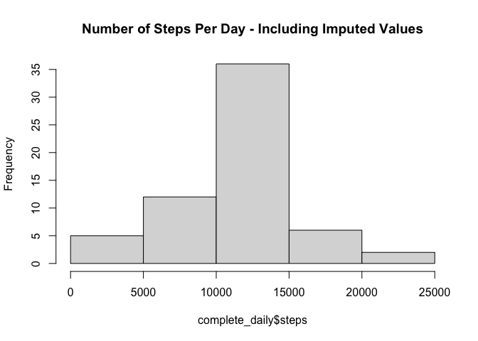
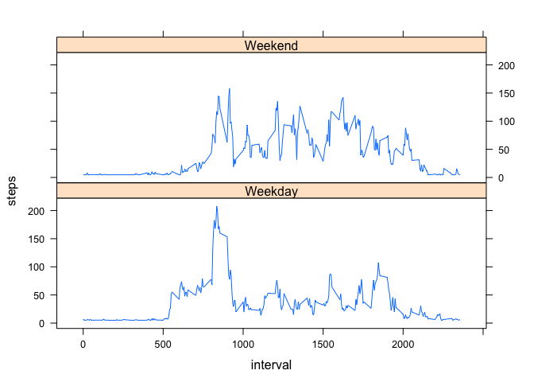

### Loading and preprocessing the data

```r
if(!file.exists("activity.csv")){
    unzip("activity.zip")
}

activity <- read.csv("activity.csv")

# Change the date variable to class "Date"
activity$date <- as.Date(as.character(activity$date), "%Y-%m-%d")
```

### What is mean total number of steps taken per day?

The dataset contains 17568 rows from two months or 61 days. To compute the mean total number of steps per day, we need to first sum up steps from all the five minutes intervals recorded each day and reduce the dataset to 53 observations after removing NA's.


```r
total_daily <- aggregate(steps ~ date, activity, FUN = sum)
mean_dailysteps <- mean(total_daily$steps)
```

Therefore, the mean number of steps taken per day is 10766

##### Make a histogram of the total number of steps taken each day.


```r
hist(total_daily$steps, col = "grey85", main = "Total Number of Steps Per Day")
```

<!-- -->

##### Calculate and report the mean and median of the total number of steps taken per day.


```r
mean_dailysteps <- mean(total_daily$steps)
median_dailysteps <- median(total_daily$steps)
```

The **mean** number of steps taken per day is 10766 while the **median** is 10765

### What is the average daily activity pattern?


```r
# The average steps for every five minute interval
total_steps_interval <- aggregate(steps ~ interval, activity, FUN = mean)
plot(total_steps_interval$interval, total_steps_interval$steps, type = "l", xlab="Five Minute Interval", ylab="Total Number of Steps", main="Number of Steps By 5 Minute Interval")
```

<!-- -->


##### The 5-minute interval that, on average, contains the maximum number of steps


```r
max_step_interval <- total_steps_interval[which(total_steps_interval$steps == max(total_steps_interval$steps)),]

max_step_interval
```

```
##     interval    steps
## 104      835 206.1698
```

The interval with the highest number of steps is 835 or between 8:35 and 8:40 with 206 steps.

### Imputing missing values

##### Calculate and report the total number of missing values in the dataset (i.e. the total number of rows with \color{red}{\verb|NA|}NAs)


```r
rows_with_NAs <- sum(!complete.cases(activity))
```

The number of rows with missing values are 2304

##### Devise a strategy for filling in all of the missing values in the dataset. The strategy does not need to be sophisticated. For example, you could use the mean/median for that day, or the mean for that 5-minute interval, etc.

Here I decide to use the simpler approach of replacing missing values for each observation with the mean for that day.


```r
# Let's create a reduced dataframe with each days and its average value for steps 
No_NAs <- activity[complete.cases(activity), ]
average_daily <- aggregate(steps ~ date, No_NAs, FUN=mean)
average_daily$steps <- ceiling(average_daily$steps) # Rounding off to compensate for the average effect

# This function takes two dataframes the original and a summary one with each days average created above
# It replaces all missing steps values of the original df with each days average from the second df
# In case like the first day where all values are NAs - I replace them wih the datasets overall average for steps
# Finally, it returns a dataset equal in length to the old activity dataframe but now with no missing values.

replace_missing <- function(org_df, avg_df){
    for(row in 1:dim(org_df)[1]){
        if(is.na(org_df[row, ]$steps)){
            step_value <- avg_df[avg_df$date == org_df[row, ]$date, ]$steps
            if(length(step_value) == 0){
                org_df[row, ]$steps <- mean(avg_df$steps)
            }else{
                org_df[row, ]$steps <- step_value
            }
        }
    }
    
    org_df
}
```


##### Create a new dataset that is equal to the original dataset but with the missing data filled in.

```r
complete_activity <- replace_missing(activity, average_daily)
dim(complete_activity)
```

```
## [1] 17568     3
```

```r
head(complete_activity)
```

```
##      steps       date interval
## 1 37.90566 2012-10-01        0
## 2 37.90566 2012-10-01        5
## 3 37.90566 2012-10-01       10
## 4 37.90566 2012-10-01       15
## 5 37.90566 2012-10-01       20
## 6 37.90566 2012-10-01       25
```

##### Make a histogram of the total number of steps taken each day 

```r
complete_daily <- aggregate(steps ~ date, complete_activity, FUN = sum)
hist(complete_daily$steps, col = "grey85", main = "Number of Steps Per Day - Including Imputed Values")
```

<!-- -->

##### Calculate and report the mean and median total number of steps taken per day.


```r
mean_completesteps <- mean(complete_daily$steps)
median_completesteps <- median(complete_daily$steps)
```

The new **mean** for the imputed dataset is 10786 and the **median** is 10917

##### Do these values differ from the estimates from the first part of the assignment? What is the impact of imputing missing data on the estimates of the total daily number of steps?

Yes. The values of the mean and the median have both increased slightly. However, the median is now more than the mean. If you compare how much each value increased after imputing the missing data, the median has registered the highest. 

### Are there differences in activity patterns between weekdays and weekends?


```r
library(chron)
library(lattice)
complete_activity$dweek <- ifelse(is.weekend(complete_activity$date), "Weekend", "Weekday")
complete_activity$dweek <- as.factor(complete_activity$dweek)
interval_dweek <- aggregate(steps ~ interval + dweek, complete_activity, FUN = mean)
xyplot(steps ~ interval | dweek, type = "l", data = interval_dweek, layout=c(1,2))
```

<!-- -->

Yes. On average, the weekends has 7 more steps for every interval than during weekdays. This suggests that the subject spends longer and consistent hours of activity during the weekends. In contract, during weekdays we can observe a sharp rise of activity regularly only at around 9 am in the morning everyday, which may corresponds to either a commute time or some routine morning activity. From there, the number of steps decline sharply and doze off.  
